# Лабораторная работа №1. Основы HTTP
## Цель
Целью данной лабораторной работы является изучение основных принципов протокола HTTP.

## Задание №1. Анализ HTTP-запросов
- Зайдите на сайт http://sandbox.usm.md/login.
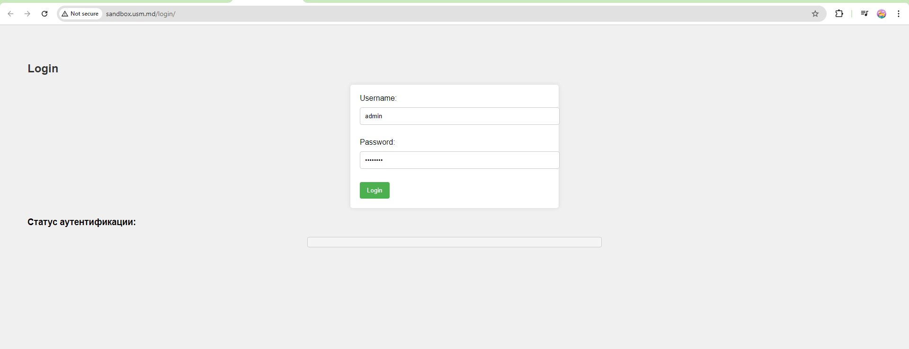
- Откройте вкладку Network в инструментах разработчика браузера.
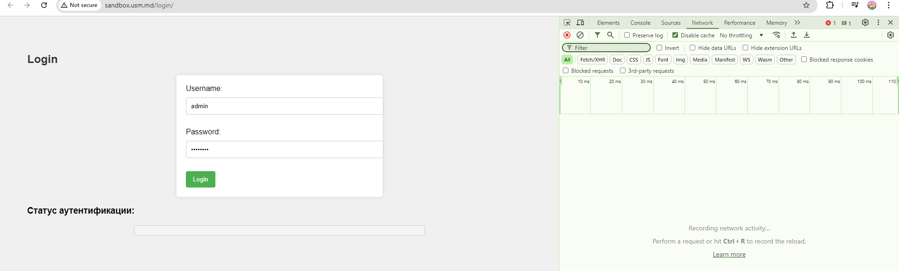
- Введите неверные данные для входа (например, username: student, password: studentpass).
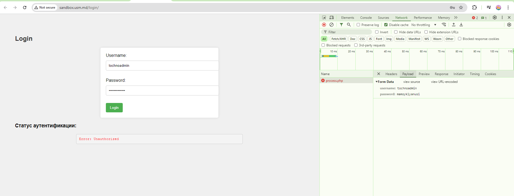

Проанализируйте запросы, которые были отправлены на сервер.

Ответьте на следующие вопросы:

- Какой метод HTTP был использован для отправки запроса?

`POST`


- Какие заголовки были отправлены в запросе?

```
Accept:
Accept-Encoding:
Accept-Language:
Cache-Control:
Connection:
Content-Length:
Content-Type:
Host:
Origin:
Pragma:
Referer:
User-agent:
X-Requested-With:
```

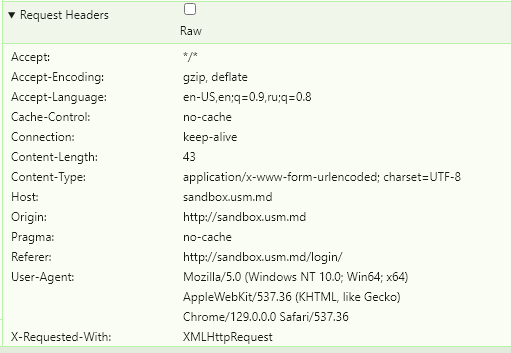

 - Какие параметры были отправлены в запросе?

В зависимости от того что понимается под параметрами, если queryParams то ничего не было отправлено.

Если имеется в виду параметры http request то Метод(POST), Uri(http://sandbox.usm.md/login/process.php), Headers указанные выше и  Payload 

`username=tochnoadmin&password=mamoyklyanusi`

 - Какой код состояния был возвращен сервером?

`401 - Unauthorized`

 - Какие заголовки были отправлены в ответе?
```
HTTP/1.1 401 Unauthorized
Server: nginx/1.24.0 (Ubuntu)
Date: Wed, 25 Sep 2024 10:32:14 GMT
Content-Type: text/plain;charset=UTF-8
Transfer-Encoding: chunked
Connection: keep-alive
```

- Введите верные данные для входа ( username: admin, password: password).

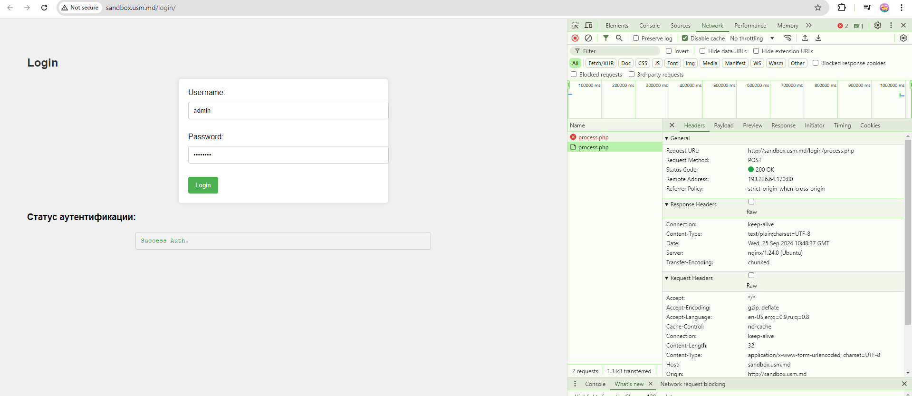

Проанализируйте запросы, которые были отправлены на сервер.

Ответьте на следующие вопросы:

- Какой метод HTTP был использован для отправки запроса?
`POST`
- Какие заголовки были отправлены в запросе?
```
Accept:
Accept-Encoding:
Accept-Language:
Cache-Control:
Connection:
Content-Length:
Content-Type:
Host:
Origin:
Pragma:
Referer:
User-agent:
X-Requested-With:
```
- Какие параметры были отправлены в запросе?
В зависимости от того что понимается под параметрами, если queryParams то ничего не было отправлено.

Если имеется в виду параметры http request то Метод(POST), Uri(http://sandbox.usm.md/login/process.php), Headers указанные выше и  Payload 

`username=admin&password=password`

- Какой код состояния был возвращен сервером?

200 OK

Какие заголовки были отправлены в ответе?
```
HTTP/1.1 200 OK
Server: nginx/1.24.0 (Ubuntu)
Date: Wed, 25 Sep 2024 10:48:37 GMT
Content-Type: text/plain;charset=UTF-8
Transfer-Encoding: chunked
Connection: keep-alive
```

## Задание №2. Составление HTTP-запросов

- Составьте GET-запрос к серверу по адресу http://sandbox.com, указав в заголовке User-Agent ваше имя и фамилию.
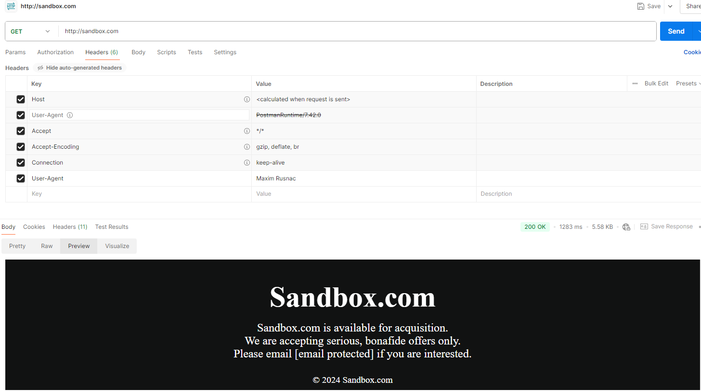

- Составьте POST-запрос к серверу по адресу http://sandbox.com/cars, указав в теле запроса следующие параметры:
make: Toyota
model: Corolla
year: 2020

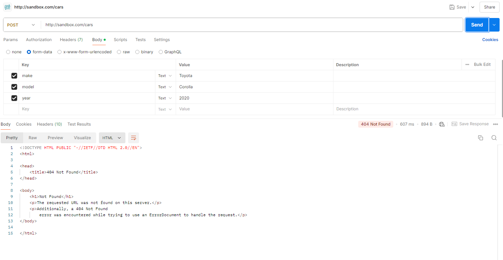

- Составьте PUT-запрос к серверу по адресу http://sandbox.com/cars/1, указав в заголовке User-Agent ваше имя и фамилию, в заголовке Content-Type значение application/json и в теле запроса следующие параметры: json { "make": "Toyota", "model": "Corolla", "year": 2021 }

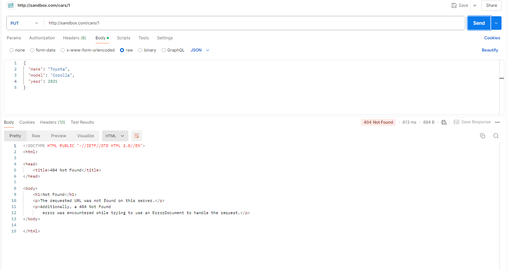
```
PUT /cars/1 HTTP/1.1
Host: sandbox.com
User-Agent: Maxim Rusnac
Content-Type: application/json
Content-Length: 64

{
  "make": "Toyota",
  "model": "Corolla",
  "year": 2021
}
```

- Напишите один из возможных вариантов ответа сервера следующий запрос.
```
 http POST /cars HTTP/1.1 
 Host: sandbox.com 
 Content-Type: application/json 
 User-Agent: John Doe 
 
 model=Corolla&make=Toyota&year=2020 
 ```
 Предположите ситуации, когда сервер может вернуть HTTP-коды состояния 200, 201, 400, 401, 403, 404, 500.

 200: Эндпоинт существует, все Заголовки корректно указаны и провалидированы, Payload был загружен и новая модель Кароллы была создана в каком то виде, или в Бд или добавлена в файл или создан новый объект и некоторая информация возвращена в body

 201: Эндпоинт существует, все Заголовки корректно указаны и провалидированы, Payload был загружен и новая модель Кароллы была создана в каком то виде, или в Бд или добавлена в файл или создан новый объект. Body - пустой

 400: Сервер считает что составленый запрос неправильный, это может быть из-за Заголовка или сервер может иметь кастомную логику и возвращать 400 на другие части запроса.

 401: Сервер считает что вы не имеете права доступа, допусти User-Agent используется как загаловок авторизации проверяющий просто имя и фамилию и данного юзера нету в списке, ну или нужен отдельный заголовок Authorization: 

403: Допустим эндпоинт которым мы хотим воспользоваться требует определенную роль, например Admin, а John Doe имеет роль USER. Так как USER != ADMIN то он не имеет права пользоваться данным эндпоинтом и потому возвращается 403 Forbidden 

404: Нету такого эндпоинта, указаный путь в URL неверный

500: Internal Server Error, произошло неожиданная ошибка на сервере! Оказывается кто-то удалил все таблицы в БД... Сервер не смог найти нужную таблицу и по итогу вернул ошибку 500 и кого-то уволили с работы.

## Задание №3. Дополнительное задание. HTTP_Quest

- Отправьте POST-запрос на сервер по адресу http://sandbox.usm.md/quest, указав в заголовке User-Agent вашу фамилию и имя (Например User-Agent: John Doe).
POST /quest HTTP/1.1
Host: sandbox.usm.md
User-Agent: John Doe
curl: curl -X POST http://sandbox.usm.md/quest -H "User-Agent: John Doe"

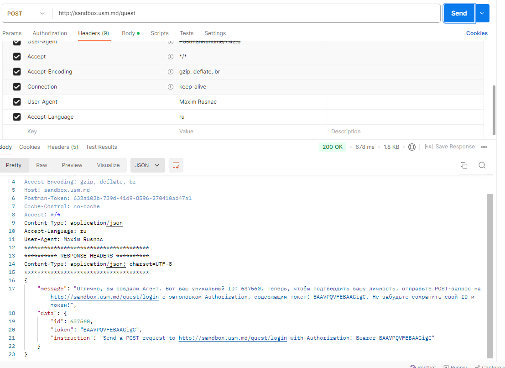

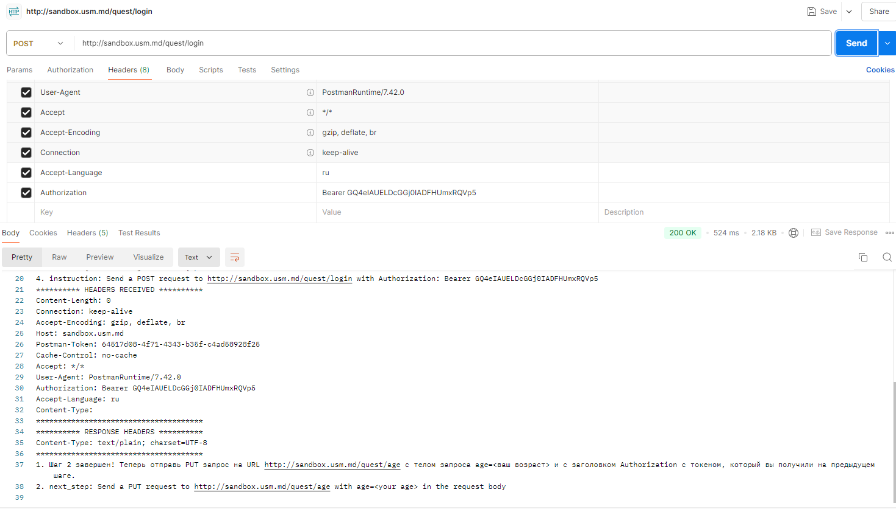

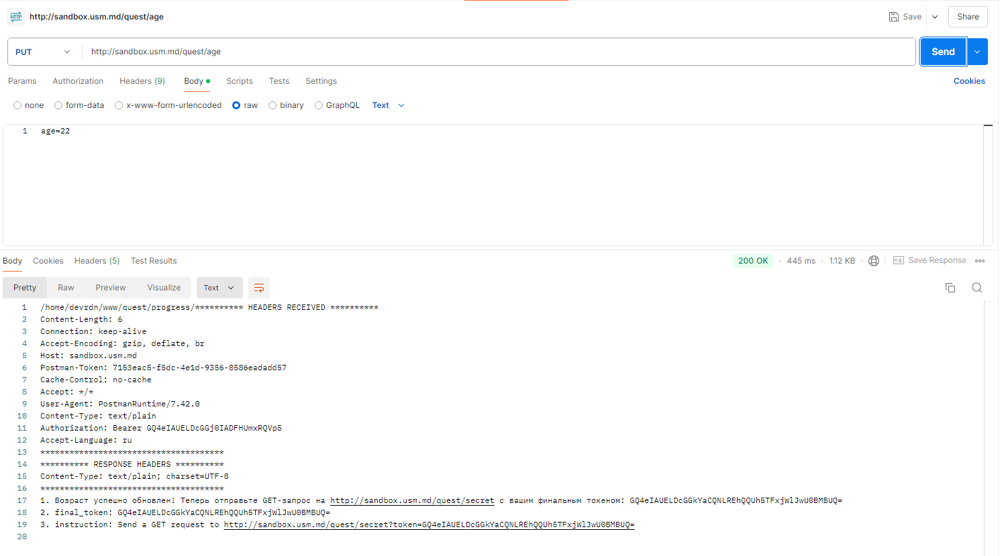

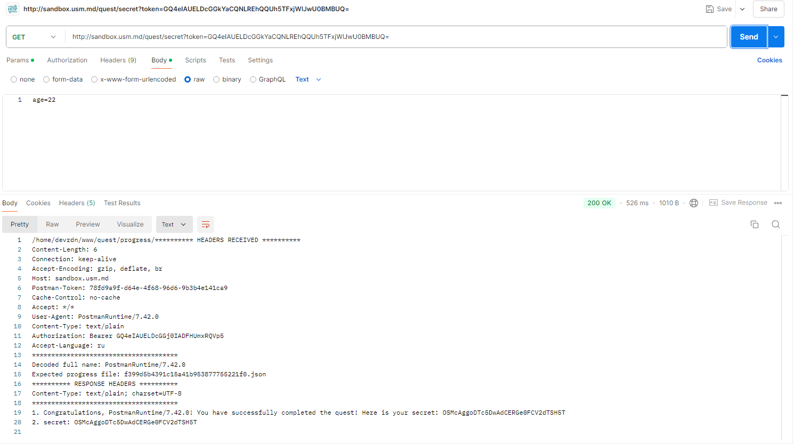

- Secret : OSMcAggoDTc5DwAdCERGe0FCV2dTSH5T